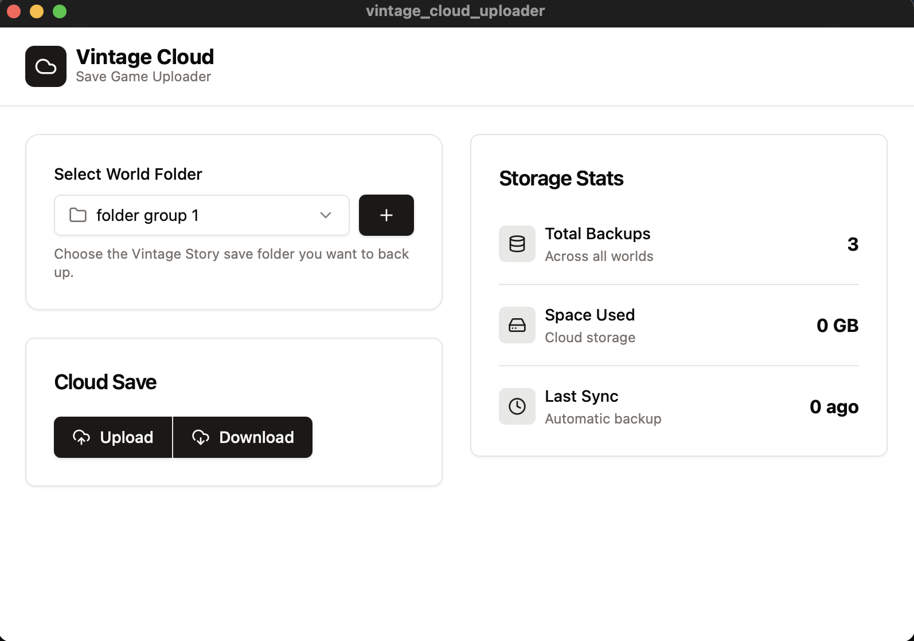
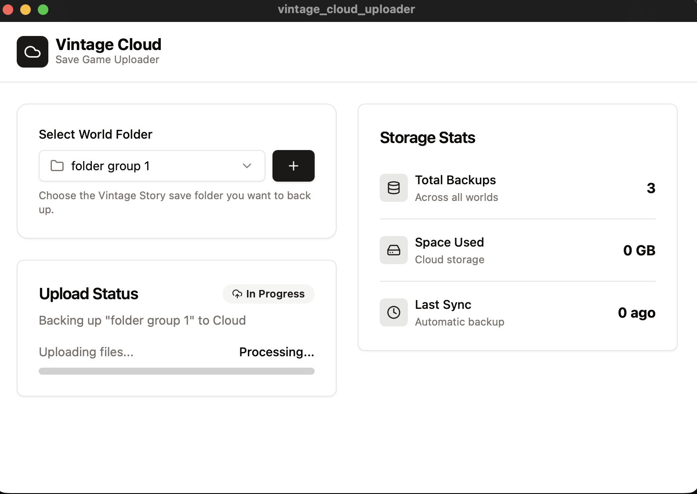

# VintageStoryCloudSave
### Version 0.0.18 Beta

Very Early Version of a basic upload download system for Vintage Story to keep your saves in the cloud

You are free to fork and continue work!
Made in Rust using Tauri

Refactored from Egui to Tauri to provide better UI

## Images




## Dependencies
- eframe = "0.33.2"
- egui = "0.33.2"
- aws-config = { version = "1.5.1", features = ["behavior-version-latest"] }
- aws-sdk-s3 = { version = "1.38.0", features = ["rustls"] }
- tokio = { version = "1.40.0", features = ["macros", "rt-multi-thread"] }
- serde = { version = "1.0", features = ["derive"] }
- serde_json = "1.0"
- dotenvy = "0.15"

## How to Build Tauri

Create your own `.env` in `/vintage_cloud_uploader/src-tauri` and put in these values from Backblaze B2:
```
B2_KEY_ID=
B2_APPLICATION_KEY=
B2_BUCKET=
B2_REGION=
B2_ENDPOINT=
```

Then build:
```
bun i
bun run tauri build
```

## How to Build Pure Egui version

### Option 1: Using .env file (Recommended for Development)

Create your own `.env` in `/cloud-save-uploader` and put in these values from Backblaze B2:
```
B2_KEY_ID=
B2_APPLICATION_KEY=
B2_BUCKET=
B2_REGION=
B2_ENDPOINT=
```

Then build:
```bash
cd cloud-save-uploader
cargo build --release
```

### Option 2: Embedding Secrets in Binary (For Distribution)

**Note:** Embedding secrets in binaries is not recommended for security reasons. Use `.env` files for development.

## To-Do
- [X] update UI
- [X] update UX
- [X] Drop Down for Cloud Save selection
- [ ] Select specific files to upload and download
- [ ] Add profiles upload
- [ ] Add mod upload
- [ ] Update progess bar as it goes
- [ ] Add login / Create account to handle token access and specific folder
- [ ] add sha256 verfication to files
- [ ] add statitics
- [ ] Read Game Data
- [ ] **Important** Set active dir for each bucket folder
- [X] Swap UI frontend to Tauri
